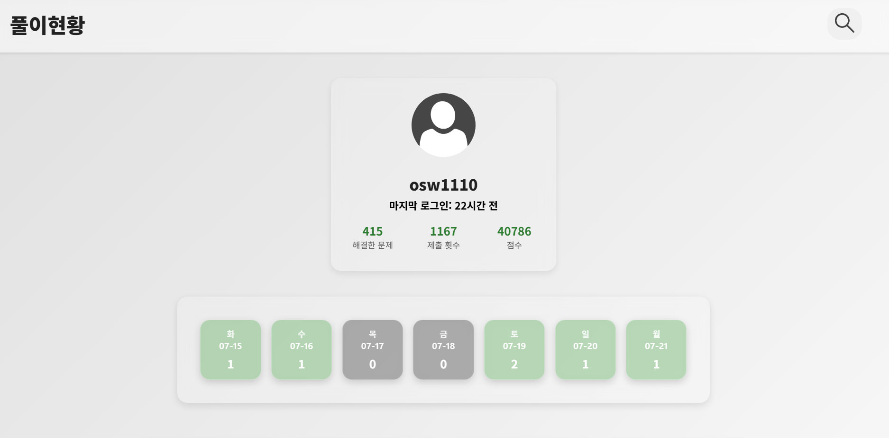
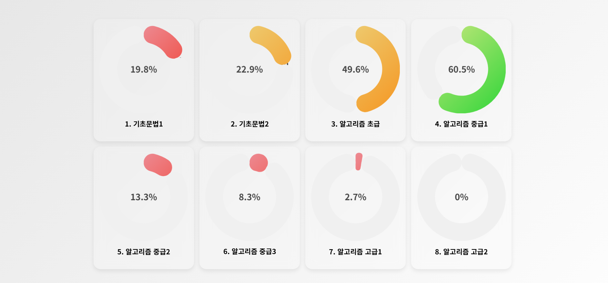

    # 📊 학습 진도 시각화 프로젝트 (API 기반)

    

    이 프로젝트는 [DoingCoding](http://edu.doingcoding.com) 학습 사이트의 **API**를 통해,
    수강생의 **문제 풀이 이력 및 학습 진도**를 수집/분석하고 시각화하는 Python 기반 도구입니다.

    > 기존 크롤링 기반 프로젝트: [crawling-edu-progress](https://github.com/sleepyhood/crawling-edu-progress)
    > 이 프로젝트는 해당 접근 방식을 **API 기반으로 리팩터링**한 버전입니다.

    ---

    ## 💡 주요 기능

    

    - 로그인 세션 유지 및 쿠키 기반 인증
    - 문제 태그(Lv, SLv) 기반 문제집 목록 수집
    - 각 문제집별 문제 상세 정보 수집
    - 사용자 제출 결과(submissions) 수집 및 정리
    - 문제집 구조로 재가공된 JSON 변환
    - Flask 등으로 시각화 웹 대시보드
    - `.gitignore`와 `.env`를 통한 민감 정보 관리
    - 로그아웃, 캐시 지우기 추가 예정

    ---

    ## 📦 사용 기술

    - Python 3.10+
    - `requests`, `selenium`, `webdriver-manager`
    - `json`, `dotenv`, `os`, `re` 등 내장 모듈
    - Git / GitHub

    ---

    # 🗂️ 프로젝트 디렉터리 구조

    ```

    .env
    .gitignore
    cookies.json # (민감 데이터 - 실제 저장소에 포함 주의)
    README.md

    src/
    ├── app.py
    ├── login.py
    ├── problems_data/
    │ ├── 1. 기초문법1.json
    │ ├── 2. 기초문법2.json
    │ ├── ...
    │ └── all_problems.json
    ├── static/
    │ ├── search-icon.png
    │ └── style.css
    ├── templates/
    │ ├── chapter_detail.html
    │ ├── group_detail.html
    │ ├── index.html
    │ └── login.html
    ├── users_data/ # 유저별 JSON 데이터 (민감 정보, 저장소 제외 권장)
    │ ├── 사용자1.json
    │ ├── 사용자2.json
    │ └── ...
    └── utils/
    ├── questions_crawler.py
    ├── request.py
    ├── streak_utils.py
    ├── summarizer.py
    ├── trash.py
    ├── user_crawler.py
    ├── 재가공.py
    └── **pycache**/

    ```

    - `src/` : 주요 파이썬 소스 및 리소스 디렉터리
    - `problems_data/` : 문제 관련 JSON 파일 저장
    - `static/` : 정적 파일(css, 이미지 등)
    - `templates/` : HTML 템플릿 파일
    - `users_data/` : 사용자별 데이터 (개인정보 포함으로 저장소 제외 권장)
    - `utils/` : 각종 유틸리티 및 크롤러 모듈
    - `.env` : 환경 변수 설정 파일 (민감 정보 포함 가능)
    - `.gitignore` : 버전 관리 제외 대상 설정

    ---

    ## 🔐 보안 주의사항

    - 아이디/비밀번호, 쿠키 등 **민감 정보는 `secrets/` 디렉토리에 분리**됩니다.
    - `.env` 예시 파일을 배포 시 제공하며, 실제 정보는 로컬에서만 관리됩니다.
    - `.gitignore`에 해당 항목이 포함되어 있으니, 깃헙에 업로드되지 않습니다.

    ---

    ## 🛠️ 개발 TODO

    - [✅] 문제 태그 기반 구조(JSON)로 재가공 정리
    - [✅] 유저별 문제집 학습 진도율 계산
    - [✅] 제출 결과 통계화 (제출 횟수, 성공률 등)
    - [✅] Flask 기반 웹 대시보드 시각화
    - [ ] `cron` 혹은 CLI 자동화 루틴 구축

    ---

    ## ⚙️ 설치 및 실행 방법 (예정)

    ```bash
    # 의존 패키지 설치
    pip install -r requirements.txt

    # 환경변수 세팅
    cp secrets/.env.example secrets/.env
    # 또는 직접 환경 변수 설정

    # 실행
    python main.py
    ```

    > ※ 실제 실행 예시는 프로젝트 진행에 따라 갱신될 수 있습니다.

    ---

    ## 🔗 참고 링크

    - 학원 사이트: [http://edu.doingcoding.com](http://edu.doingcoding.com)
    - 이전 프로젝트: [crawling-edu-progress](https://github.com/sleepyhood/crawling-edu-progress)

    ---

    ## 📝 라이선스 및 기여

    - 개인 학습용으로 제작된 프로젝트입니다.
    - 외부 기여, Pull Request 환영합니다!
